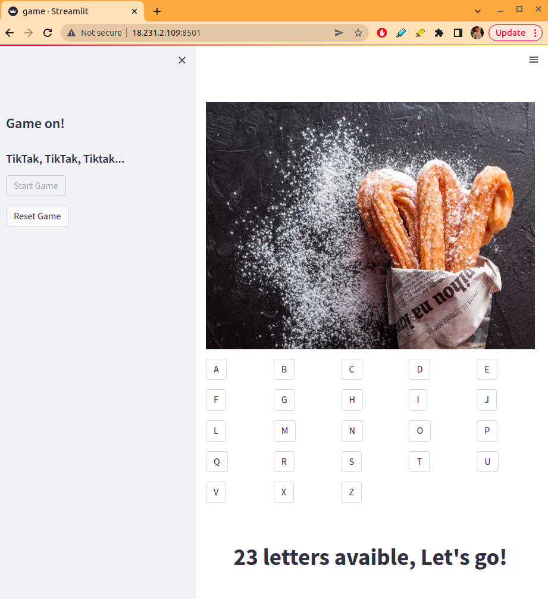
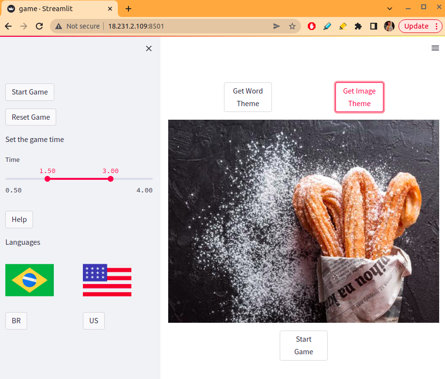
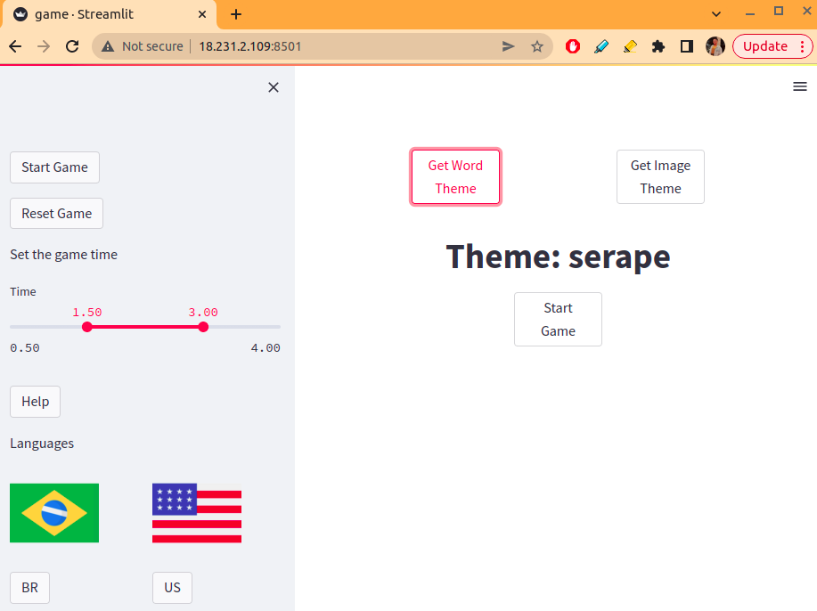
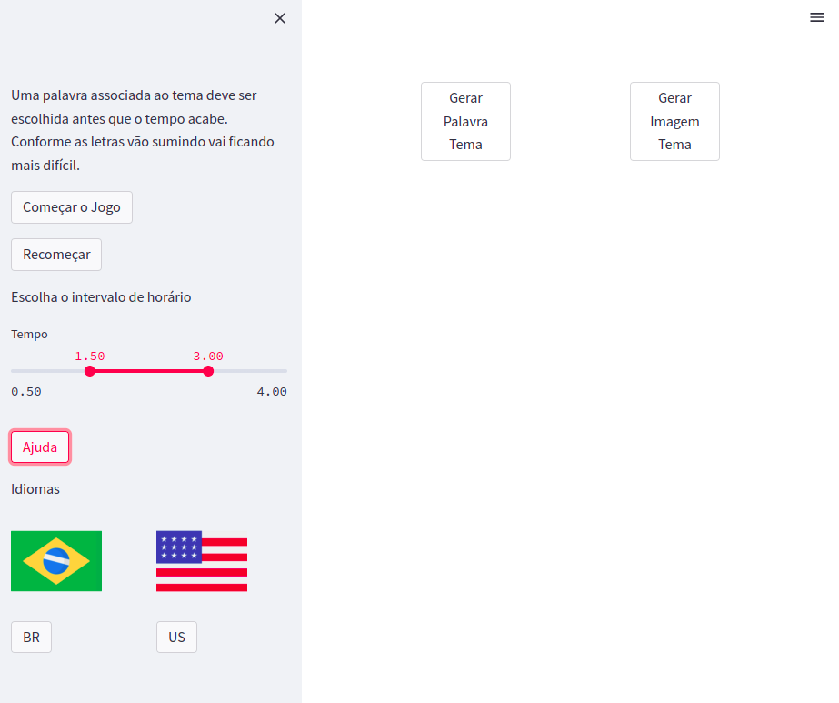

## Game 

In this game, people should say a word related to the theme fastly, since there is a limited time to it. Whent the time is over the one palying is the loser.
The time and theme are randomly chosen.

## Translations

This game suports two laguanges so far and more can easly be add by simple modifications in the settings files.
The translations class manage the language change in the game.

## Ninja API

So far, in english, the random word and Image are provided by Ninja API.

## Deployment 

This game was deployed on AWS EC2. 
To acess it follow the link:

## Visual Demo

Game ON

Image Theme

Word Theme

PT-BR Help Button

